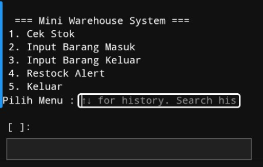

# Python WMS CLI

Mini Warehouse Management System (WMS) berbasis Command Line Interface (CLI) yang dibuat menggunakan Python.
Proyek ini merupakan latihan membangun sistem manajemen stok sederhana yang nantinya dapat berkembang menjadi POS atau ERP kecil.

Project ini dikembangkan langsung dari kebutuhan operasional warung nyata, sehingga fokus utamanya adalah:

- pencatatan stok
- pergerakan barang
- kontrol restock
- penyimpanan data lokal

---

## Features

### Current features:

- 📦 Inventory tracking
- ➕ Stock in (barang masuk)
- ➖ Stock out (barang keluar)
- ⚠ Restock alert system
- 💾 JSON database persistence
- 🖥 CLI menu interface
- 🛠 Input validation

---

## Tech Stack

- Python 3
- JSON (local database)
- Standard Python libraries

## Modules used:

json
os
datetime

---

Project Structure

python-wms-cli/

│

├── wms_cli_v2.py

├── WMS_db.json

└── README.md

- wms_cli_v2.py → main application
- WMS_db.json → local database
- README.md → project documentation

---

## Database Structure

The system uses a JSON-based inventory database.

Example:

{
 "kopi": {
  "stok": 10,
  "min_stok": 3
 },
 "gula": {
  "stok": 5,
  "min_stok": 2
 }
}

This structure allows the system to scale later with additional fields such as:

- price
- category
- supplier
- barcode

---

## How to Run

Run the program from terminal:

python wms_cli_v1.py

python wms_cli_v2.py

Or using Termux:

python wms_cli_v1.py

python wms_cli_v2.py

---

## Future Roadmap

### Planned upgrades:

- Transaction logging
- POS CLI integration
- Daily sales reports
- Inventory analytics
- Web interface

---

Author

Created by Thery Vissabillillah

Background:

- SMK Accounting graduate
- Learning Python through real-world business problems
- Building small business management tools

---

## Project Goal

This project is part of a long-term goal to build a lightweight ERP system for small businesses and UMKM.

Starting from:

Inventory System

↓

POS System

↓

ERP CLI

↓

Web ERP

## Changelog

### v1.0
- Initial CLI warehouse management system
- Stock in / stock out
- Restock alert
- CLI menu system

### v2.0 (in progress)
- JSON database persistence
- Auto load / save database
- Inventory stored locally

## Screenshot

Example CLI interface:

